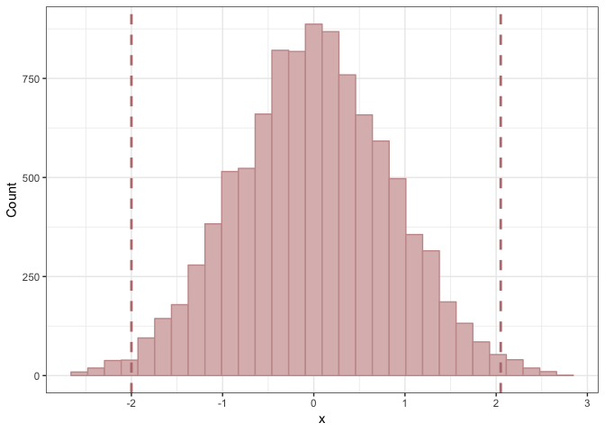

README
================
John Helveston
4/30/2019

# stanTuner

This code uses the algebra solver in [Stan](https://mc-stan.org/) to
find the parameters of a distribution that produce a desired tail
behavior. This can be useful when choosing parameters for prior
distributions.

Here’s how to use it: 1. Select a distribution. 2. Define the quantile
boundaries and the amount of probability density that you wish to have
above and below those boundaries. 3. Let Stan go find the parameters
that produce the desired distribution.

Check out the `examples.R` file for a few examples.

Currently supported distributions: \* Normal \* Beta \* Inverse Gamma

# Example

Let’s say I want to find the parameters of a normal distribution such
that P\[x \< -2.0\] ~ 0.01 and P\[x \> 2.0\] ~ 0.01. That is, I want a
normal distribution where 98% of the probability density is between (-2,
2).

First, load the rstan library, tweak some settings, and source the
`utility.R` file:

``` r
library(rstan)
# Set auto_write to false because I want to always search from scratch
rstan_options(auto_write = FALSE)
options(mc.cores = parallel::detectCores())

util <- new.env()
source('utility.R', local=util)
```

Use the `targets` argument to set these boundaries:

Then use the `tuneParams` function to find the parameters:

``` r
result = util$tuneParams(distribution='normal', targets)
```

    ## 
    ## SAMPLING FOR MODEL 'model' NOW (CHAIN 1).
    ## Chain 1: Iteration: 1 / 1 [100%]  (Sampling)
    ## Chain 1: 
    ## Chain 1:  Elapsed Time: 0 seconds (Warm-up)
    ## Chain 1:                2.2e-05 seconds (Sampling)
    ## Chain 1:                2.2e-05 seconds (Total)
    ## Chain 1:

View the resulting parameters and verify that the quantiles of 10,000
draws from the resulting distribution match your criteria:

``` r
result$params
```

    ## $mu
    ## [1] 0
    ## 
    ## $sigma
    ## [1] 0.85972

``` r
result$quantiles
```

    ##        1%       99% 
    ## -1.992413  2.007378

Finally, view a histogram of the resulting distribution:

``` r
result$histogram
```

<!-- -->

# Author and License

  - Author: John Paul Helveston (www.jhelvy.com)
  - Date First Written: Tuesday, April 30, 2019
  - License: GPL-3
